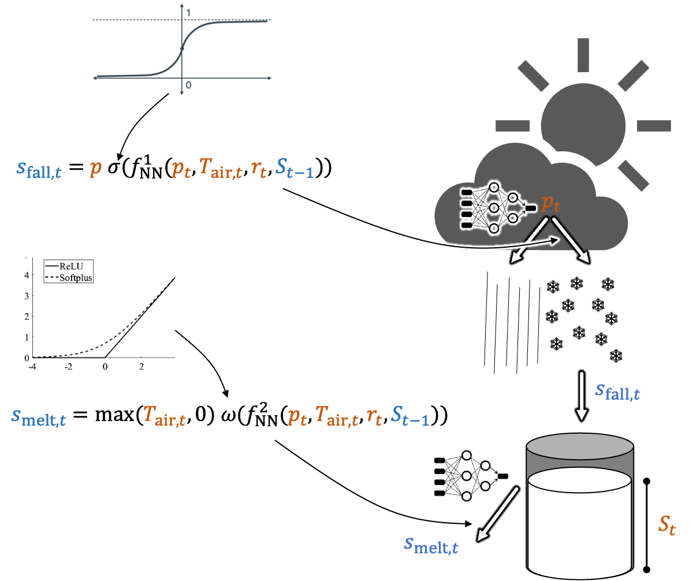

# Hybrid model of snow water eqivalent

Simple hybrid model of snow water equivalent (SWE) for educational purpose

# Getting started

Only tested on MacOS and Linux

1. Install the [conda environment manager](https://conda.io/projects/conda/en/latest/user-guide/install/index.html)
2. Open a terminal and navigate to the project path
3. Run `conda env create --quiet --file environment.yml`
4. Activate the environment with `conda activate pytorch_basic`
5. Run `jupyter lab` in the terminal, follow the link to open the Jupyter lab in your browser
6. Open `pytorch_intro.ipynb` or `hybrid_intro.ipynb`
